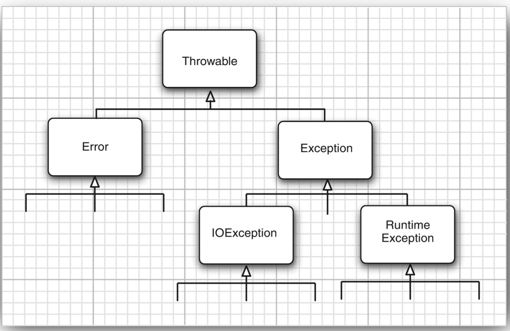

# Exceptions, Assertions, and Logging

## Dealing with Errors

### The Classification of Exceptions

继承关系:

exception object 都是从 `Throwable` 继承下来的实例. 如果没有合适的内建 exception class, 你可以创建自己的 exception class.

`Error` hierarchy 描述内部错误和资源耗尽的情况, 不应该抛出这种类型的错误.

我们应该关注 `Exception` hierarchy. exceptions 分为 `RuntimeException` 和其他不是 `RuntimeException` 的.

从 `RuntimeException` 继承下来的 exception 包括:
- A bad cast
- An out-of-bounds array access
- A null pointer access

不是从 `RuntimeException` 继承下来的 exception 包括:
- Trying to read past the end of a file
- Trying to open a file that doesn't exist
- Trying to find a `Class` object for a string that does not denote an existing class

### Declaring Checked Exceptions

### How to Throw an Exception

### Creating Exception Classes

## Catching Exceptions

## Tips for Using Exceptions

## Using Assertions

## Logging

## Debugging Tips

